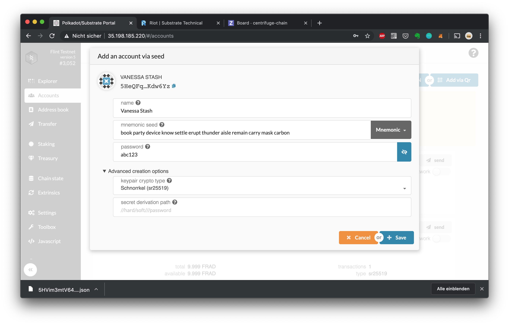
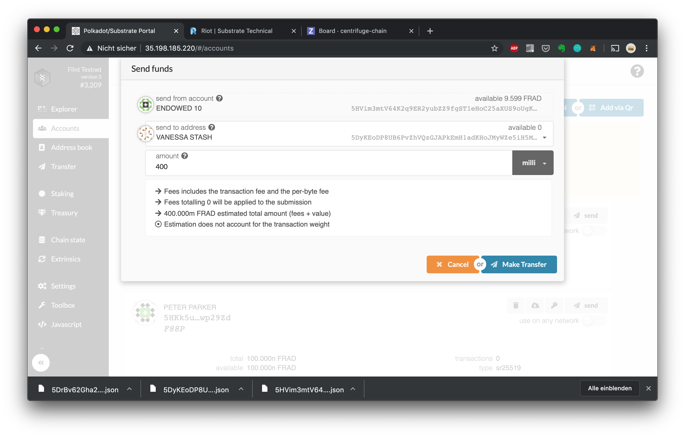
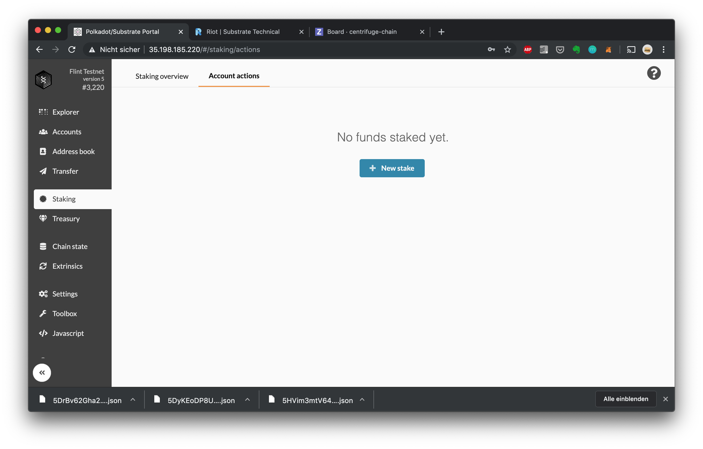
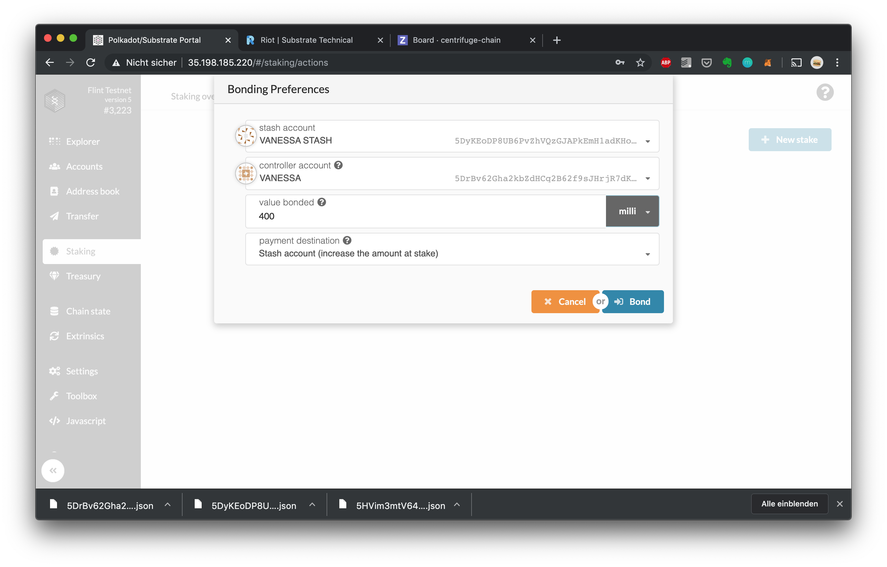
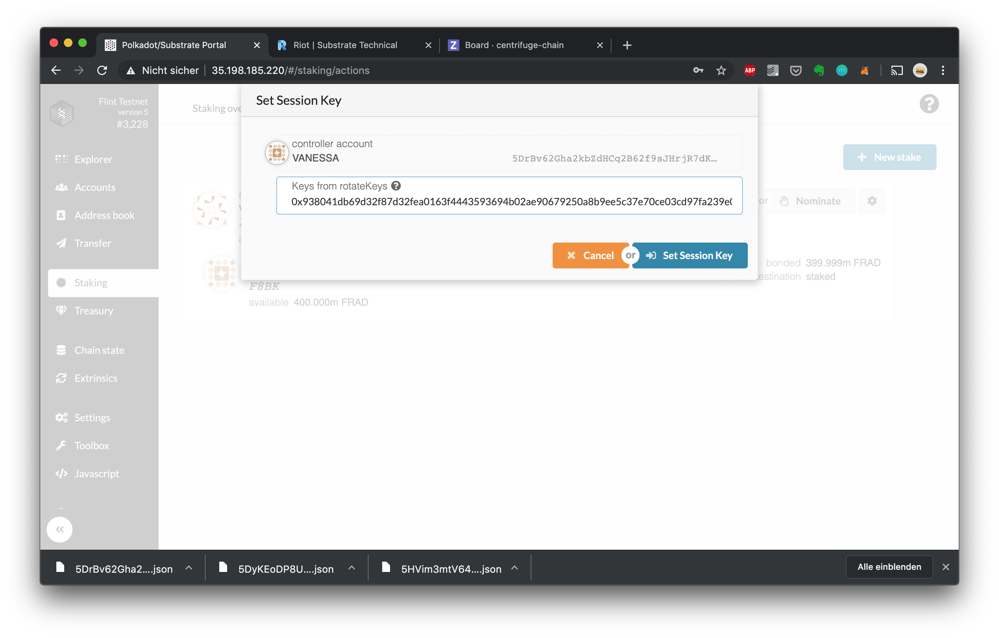
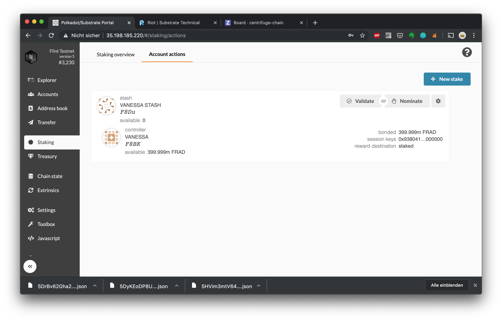
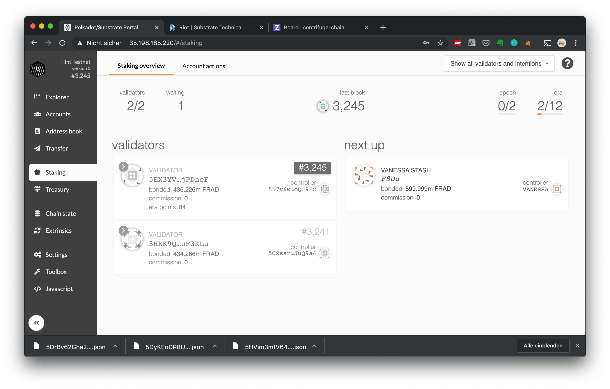
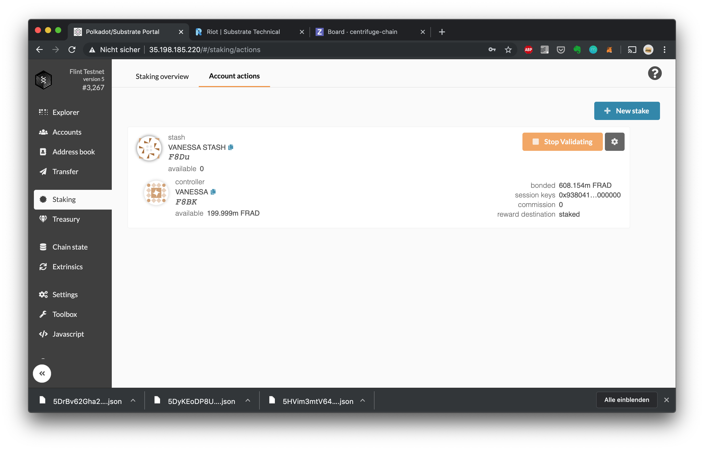
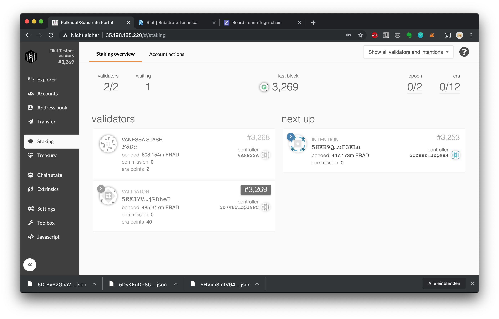

## Introduction

### The Centrifuge Stack

The Centrifuge mission is to change the rules of global trade to foster economic opportunity everywhere. Global B2B spend (a.k.a. sent invoices) amounts to roughly [\$180 Trillion](https://www.businesswire.com/news/home/20121017005521/en/Visa-Estimates-109.1-Trillion-Global-Commercial-Spend). With payment terms at an average of [60 days](https://www.statista.com/statistics/474224/average-wait-for-invoice-payment-by-sector-united-kingdom/), businesses, and especially SMEs, need financing to bridge the gap. It is one of the main reasons that sustainable growth is so much harder for SMEs than for larger corporates. Existing solutions today, such as factoring and reverse factoring, only address a small portion of that need. This is why we built Centrifuge OS — to allow businesses to exchange business documents (such as invoices) and tokenize those assets to have [greater access to financing](https://medium.com/centrifuge/centrifuge-tinlake-adding-real-world-assets-to-mcd-68cbcb67e9a4) — **thereby unlocking value that has previously been inaccessible.**


Centrifuge OS is a decentralized platform to support a new generation of applications for the financial supply chain. The stack consists of a peer-to-peer messaging protocol to store and exchange business documents in a private, secure way. As the next layer, we built Centrifuge Chain using Substrate to hold the unalterable, single source of truth of these documents for all parties. Using Centrifuge Chain and dApps built on top, businesses can tokenize documents and use this as collateral to access financing. Tinlake is our securitization protocol for these tokenized assets built on Centrifuge Chain to optimize risk allocation and connect Centrifuge to the DeFi ecosystem.

### Centrifuge Chain

[Centrifuge Chain](https://github.com/centrifuge/centrifuge-chain) is the gateway for real-world assets to the Blockchain Multiverse. We built Centrifuge Chain on [Parity Substrate](https://substrate.dev) with an initial bridge to Ethereum. This allows us to move faster and use a consistent approach for certain features.

At the same time we are able to develop a standardized bridge to Ethereum that can be reused by other projects, which in turn increases interoperability. Substrate allows us to easily tap into the [Polkadot](https://polkadot.network) ecosystem and to connect with other blockchains that support the standard.

We envision a larger ecosystem of many, connected blockchains- where Dapps on Ethereum could use data from other chains, value could move freely, and Centrifuge Chain can [enable off-chain assets to access financing](https://medium.com/centrifuge/centrifuge-chain-the-gateway-for-real-world-assets-to-the-blockchain-multiverse-41dd5597ecf1) through DeFi.

#### Centrifuge Chain Efficiencies

Centrifuge Chain is optimized specifically for the transactions required by our specific use case. This focus allows us to improve upon our current architecture in a few key ways: speed, cost, storage efficiencies, and privacy.

Ethereum works well for low volumes of high value transactions. High volumes of privacy-requiring use-cases require a different solution. The average business user, SMBs and large enterprises alike, would be paying many times more using Centrifuge on Ethereum compared to their existing solutions. It wouldn’t be worth it for most businesses to make a switch. But what if we could lower that cost and have high throughput capabilities?

The transactions on the Centrifuge Chain are optimized for the small subset of operations needed by our specific use case. This allows for faster execution of logic and finality of transactions. The optimization of transactions, together with our PoS architecture, is also what brings down the transaction costs dramatically. Centrifuge Chain also implements a state rent model that requires users to pay for continuous availability of their data over long periods of time. This encourages decentralization because less resources are required to run a node. Building our own chain also allows us to improve upon the user and developer experience for Centrifuge. Our users require privacy, and this is something we can build for directly — targeting the features they need from the start. For developers, we can provide custom APIs and tools that come with the blockchain node itself instead of smart contract APIs which are harder to integrate with.

Centrifuge Chain is optimized specifically for the transactions required by the protocol. This achieves a much more efficient execution of these transactions and allows for targeted use-cases. While there are downsides to building a single purpose chain, the advantages for our use case outweigh the costs. Integration with other Ethereum and DeFi projects becomes a bit more involved. Our experience with Ethereum development, combined with a standardized bridge to get data to/from our Parity Substrate based chain reduces the overhead substantially, while still benefiting from the upside of our own chain.

#### How does Centrifuge Work?


A company, such as Paper Records, uses the Centrifuge P2P Network to sign and send an invoice to Spotify. Spotify verifies receipt of the document and its correctness with its signature and sends an updated, signed version of the document back to Paper Records. Centrifuge Chain is used for the node identities, allowing Paper Records to look up Spotify and for Spotify to verify Paper Records. Paper Records is then able to anchor the document hash with both signatures onto Centrifuge Chain. Using these elements Paper Records can now mint an NFT on Centrifuge Chain that represents the unpaid invoice — **_and use this NFT as collateral to access financing_** on other blockchains such as Ethereum. Third parties, from traditional lenders to DeFi lending pools, can verify the value of the NFT against the on-chain anchors and identities, as well as get access granted to the off-chain document whose authenticity can be verified against the on-chain anchor as well.

### Chain Architecture

Centrifuge Chain uses its own native token - the Radial (RAD) token. It also incentivizes Validators and Nominators to participate through a block reward.

Centrifuge Chain is built on [Parity Substrate](https://substrate.dev), and relies on staked Validators to come to consensus over 3 components to commit blocks to the blockchain:

- BABE - block production/authorship
- GRANDPA - finality gadget
- NPoS - Validator selection algorithm

Any node can offer itself as a Validator candindate, but only a limited number will be selected. Only top Validators by stake are elected into the Validator Set. Validators can stake their own RAD and can be elected by staked Nominators.

Validators must run a full node and directly particiate in block authorship, finality, and validity checks. They are able to choose a reward commission that is taken up-front from the reward before splitting the remainder with Nominators.

Validators must stay online and available with very high up-time. They will be held responsible and incur slashing penalties for deliberate attacks, running modified software, severe bugs in the code, and unresponsiveness, to name just a few slashing conditions.

For a deeper dive into the Radial token that powers Centrifuge Chain, read our **[Radial Token Summary](https://ir.centrifuge.io/static/rad-executive-summary-8e1bfe96bbae3981fe43e4bf1fbcec70.pdf)**.

## Centrifuge Chain Test Networks

Centrifuge has multiple testnets online that have been created to test and stabilize the interaction between Centrifuge’s components, but are unaudited and experimental for now. These testnets have no economic value on-chain.

- **Amber** is our release candidate and our second testnet. It is meant for audits and testing the stability of release candidates. Think of Amber as a way to test beta releases.

- **Flint** is our first testnet that has been running since November 2019. It is meant for breaking changes and testing integration with other parts of the Centrifuge ecosystem. Think of Flint as a way to test previews and alpha releases.

### View the status of the testnets on Polkadot Telemetry:

Some nodes on our testnets are reporting telemetry ot telemetry.polkadot.io. You can look at the information here:

- [Amber Network Telemetry](https://telemetry.polkadot.io/#list/Centrifuge%20Testnet%20Amber%20CC2)

- [Flint Network Telemetry](https://telemetry.polkadot.io/#list/Centrifuge%20Testnet%20Flint%20CC3)

## Create an Account

### Chain Portal

Centrifuge hosts an instance of the chain portal at [portal.chain.centrifuge.io](https://portal.chain.centrifuge.io). You can use it to interact with a full node provided by Centrifuge. The portal serves all three of our permanent networks.

**Mainnet:** https://portal.chain.centrifuge.io/#?rpc=wss://fullnode.centrifuge.io<br />
**Amber:** https://portal.chain.centrifuge.io/#?rpc=wss://fullnode.amber.centrifuge.io<br />
**Flint:** https://portal.chain.centrifuge.io/#?rpc=wss://fullnode.flint.centrifuge.io

### Create an account/key pair using the Portal UI

1. Open the Portal
1. Create a new account for your user by navigating to "Accounts" and clicking "Add account".

   Fill in the form, e. g. for Peter Parker: 

1. Click "Save" and then "Create and backup account". Make sure you save the downloaded JSON file in a safe place.

1. Done! You can now copy your address and send it to others to receive tokens. The address is the string starting with `5...` under the name of your account, e. g. `5HKk5u...wp29Zd` in the following. You can copy it by clicking on the icon to the left of your account name: 

### Create an account using the Parity Signer App

This is an unofficial guide on how to use the Parity Signer App to create an account on Centrifuge Chain. Please consult the official Parity Signer documentation [here](https://github.com/paritytech/parity-signer).

| DISCLAIMER: _Use of this guide is at your own risk. To the maximum extent permitted by applicable law, the services are provided without warranties of any kind, whether express, implied, statutory or otherwise, including, but not limited to, implied warranties of merchantability, fitness for a particular purpose, title, quiet enjoyment, accuracy, or non-infringement. Further, to the fullest extent allowed by applicable law, in no event shall the company or its affiliates, be liable to you or any third party for any damages of any kind._ |
| -------------------------------------------------------------------------------------------------------------------------------------------------------------------------------------------------------------------------------------------------------------------------------------------------------------------------------------------------------------------------------------------------------------------------------------------------------------------------------------------------------------------------------------------------------------- |


#### How to connect to Centrifuge Chain Mainnet

1. Open the Portal Website on your computer at: https://portal.chain.centrifuge.io/

2. In the top left, ensure that the Newtork is set to 'Centrifuge Mainnet'


3. To navigate to Mainnet, or to one of the Centrifuge testnets Amber or Flint, click on the top left corner and select custom endpoint to change the network.


4. For Mainnet, the endpoint should be set to `wss://fullnode.centrifuge.io`. Once a new endpoint is set, Save & Reload


#### How to Generate an Address Using Parity Signer

1. Buy an old or new device (ex. ipod touch, android phone, etc.)
   - **Important** only charge it with a battery bank or wall charger, **don’t plug it into a computer!!!** Use a charge only cable, not a data cable.
1. Set up a passcode and set it to wipe the device upon entering the code incorrectly too many times.
1. Install the [Parity Signer App](https://www.parity.io/signer/) from below links:
   - [Link for apple device](https://itunes.apple.com/us/app/parity-signer/id1218174838)
   - [Link for android device](https://play.google.com/store/apps/details?id=io.parity.signer)
1. Never connect the the device to a computer, even to upgrade it.
1. Turn off wifi & bluetooth (**NEVER TURN IT ON AGAIN!**)
1. Create a key for Centrifuge Mainnet using the Parity Signer App

   - Create your identity to get started

   

   - Write down your 24 word Recovery Phrase (**THIS IS VERY IMPORTANT**)

   

   - Set your Identity PIN
     - **You will use this PIN to sign all of your transactions using this device.**
   - Create your first Keypair - select the Centrifuge Mainnet Network

   

1) Get your address by scanning the QR code on the Portal Website.

   - On your computer, navigate to https://portal.chain.centrifuge.io/
   - Make sure the endpoint is set to `wss://fullnode.centrifuge.io`
   - Click on Accounts
   - Click on 'Add via QR'

     

   - Scan the QR code on your device for your Centrifuge Mainnet Public Address

     

   - Your address for Centrifuge Mainnet should begin with a '4...'

1) To manually check the above process:
   - Delete the key from the app
   - Recover the key from your backed up phrase
   - Verify the address matches what you obtained above
1) Send some test RAD to another address and use Parity Signer to sign this transaction

   - If you don't have any RAD, email faucet@centrifuge.foundation to request some RAD for this test
   - Initiate a transfer on the Portal Website by selecting 'Transfer' in the left menu or on 'Send' from the Accounts page
   - Click 'Make Transfer'
   - Click 'Sign via QR'
   - Using the Parity Signer App, scan the QR code in your browser with the App's QR Scanner from this account screen:
     
   - In the app, confirm your signature of the transaction by entering your PIN
   - Click 'Scan Signature QR' in the browser
   - Sign the transaction

1) Backup your Recovery Phrase and keep it somewhere safe. Please do research on secure methods for storage and recovery.

If you intend to stake your tokens towards validators on Centrifuge Chain, it is advised to generate another address (a "controller" address). You can generate that address by adding a new Identity and following steps 6 to 10 above, which gives you a new recovery phrase.

To add a new identity:

- Select the person icon on the top right
- Select 'Add Identity'


> **A note on app updates:**
> If a new version of the app becomes available, please exercise the following caution.
> Ideally, replace the device or do not update the app.
> If an update is necessary:
>
> 1.  Hard reset the device and wipe everything
> 2.  Re-install the new parity signer app
> 3.  Turn off wifi & bluetooth (**NEVER TURN IT ON AGAIN**)
> 4.  Recover your key from seed phrase

#### Remember to write down your secret phrase & STORE IT SAFELY!

- Follow a secure protocol to save and store your private keys. Please do some research and choose a secure method that will work best for you.

### Getting Tokens

#### Mainnet

If you need RAD to run a Validator or interact with Centrifuge Chain, email faucet@centrifuge.foundation.

#### Amber/Flint

You can get the testnet tokens _Amber Radial (ARAD)_ or _Flint Radial (FRAD)_ from BlockXLabs' faucet:

[BlockXLabs Faucet](https://faucets.blockxlabs.com/centrifuge)

If you have a need for more ARAD or FRAD than what the faucet provides, we can send you more on a case by case basis. Please reach out to us at chain@centrifuge.io with a description of what you want to use the tokens for and your address so we can send you the appropriate amount.

## Run Node

### Requirements

**_System Requirements_**
We recommend consulting the [standard hardware](https://wiki.polkadot.network/docs/en/maintain-guides-how-to-validate-polkadot#standard-hardware) section of the Polkadot Wiki for specs.

Below we describe two ways of running our chain node:

1. **Docker Container**
   This is the recommended way to experiment with your own node. It will get you started within 5 minutes. Since docker is running pre-build containers, this setup minimizes the steps required to get started and isolates any potential issues.

2. **Bare Metal**
   Running a bare metal setup requires you to compile centrifuge chain from source, which can take between a 10 minutes up to 4 hours, depending on your specs. For a production grade setup, we do recommend to run a bare metal validators for 2 reasons: a) It minimizes the tools involved, which increases security, b) The performance is slightly supperior.

### Run your node in a Docker Container

1. Ensure you have [docker](https://docs.docker.com/install/) as well as [subkey](https://substrate.dev/docs/en/knowledgebase/integrate/subkey) installed. Use `subkey` version `v2.0.0`.
2. Generate a new key pair with subkey that will be used as your node-key: `subkey generate`. Make sure you save the output in a safe place. For mainnet keys use network flag: `subkey generate -n centrifuge`
3. Start your node by running the following, where {name} is the name that will show up in Polkadot Telemetry and {node-key} is the private key you just generated (without the `0x` prefix). Note that we do expose RPC and WS ports here for simplicity – these ports should not be exposed in a production grade setup.

a) Flint:

```
docker run -p 30333:30333 -p 9933:9933 -p 9944:9944 --rm -it centrifugeio/centrifuge-chain:20201022093419-da56ac5 \
    centrifuge-chain \
    --validator \
    --name="{name}" \
    --node-key={node-key} \
    --chain=flint \
    --bootnodes=/ip4/35.246.197.135/tcp/30333/p2p/12D3KooWBF1RdctVztxLLzEwUiuMtqEDVicCjVCS8eyxh71nonxz \
    --bootnodes=/ip4/34.89.219.76/tcp/30333/p2p/12D3KooWNHRdve4U1rsZsDnTKbY8C94Y7VJTrifBy9P2LXLDhCnG \
    --unsafe-rpc-external --unsafe-ws-external --rpc-cors="*"
```

b) Amber:

```
docker run -p 30333:30333 -p 9933:9933 -p 9944:9944 --rm -it centrifugeio/centrifuge-chain:20201022093419-da56ac5 \
    centrifuge-chain \
    --validator \
    --name="{name}" \
    --node-key={node-key} \
    --chain=amber \
    --bootnodes=/ip4/34.107.94.59/tcp/30333/p2p/12D3KooWQ3YL8sP2M1S9PVNj8JjmACUjawwRPckzL8fJmXZ7YRPY \
    --bootnodes=/ip4/35.242.247.213/tcp/30333/p2p/12D3KooWECFKJirQiVHeidSkwrEocPr7wkUw3ijbJKNyvCVd3xcu \
    --unsafe-rpc-external --unsafe-ws-external --rpc-cors="*"
```

c) Mainnet:

```
docker run -p 30333:30333 -p 9933:9933 -p 9944:9944 --rm -it centrifugeio/centrifuge-chain:20201022093419-da56ac5 \
    centrifuge-chain \
    --validator \
    --name="{name}" \
    --node-key={node-key} \
    --chain=mainnet \
    --bootnodes=/ip4/34.89.245.58/tcp/30333/p2p/12D3KooWAVAMPNJywZS3J4be8gFGZACfgt1rXS3MyJ2MxEGtLXjr \
    --bootnodes=/ip4/35.246.188.4/tcp/30333/p2p/12D3KooWCUjDbbhJf1o6skuE1EJ5PnKpJMaK6scmvWsHnjAULzDU
```

\*\* Mainnet deployments should follow a more secure setup. Learn more here: https://github.com/w3f/polkadot-secure-validator

4. Generate new session keys in your node's keystore by running: `curl -H 'Content-Type: application/json' --data '{ "jsonrpc":"2.0", "method":"author_rotateKeys", "id": 1 }' http://127.0.0.1:9933` This command will return the public keys under the "result" field starting with `0x...`, which you should copy in order to use them in the next chapter.

### Bare metal instructions

1. Install dependencies:

   a) On Unix systems (Debian, Ubuntu, ...): `sudo apt install -y cmake pkg-config libssl-dev git gcc build-essential clang libclang-dev`

   b) On MacOS: `brew install openssl cmake llvm`

2. Install Rust: `curl https://sh.rustup.rs -sSf | sh`
3. Make sure that you are using the latest Rust stable by default: `rustup default stable`
4. Install nightly for WASM support:
   ```
   RUST_TOOLCHAIN=nightly
   rustup update $RUST_TOOLCHAIN
   ```
5. If above does not work, use:

   ```
   RUST_TOOLCHAIN=nightly-2020-08-16
   rustup update $RUST_TOOLCHAIN

   rustup toolchain install $RUST_TOOLCHAIN
   rustup default $RUST_TOOLCHAIN

   rustup target add wasm32-unknown-unknown --toolchain $RUST_TOOLCHAIN
   ```

6. Add the WASM target: `rustup target add wasm32-unknown-unknown --toolchain $RUST_TOOLCHAIN`
7. Clone centrifuge-chain: `git clone -b v2.0.0-rc6.0 git@github.com:centrifuge/centrifuge-chain.git`
8. Change directory: `cd centrifuge-chain`
9. Optional - run the tests: `cargo test --all`
10. Build Centrifuge Chain: `cargo build --release`
11. Ensure you have [subkey](https://substrate.dev/docs/en/knowledgebase/integrate/subkey) installed (can be on another machine).
12. Generate a new key pair with subkey that will be used as your node-key: `subkey generate`. Make sure you save the output in a safe place.

The node is now built and available in `target/release/centrifuge-chain`.

#### Executing the binary

Below are the commands to start a node as a validator. `{name}` is the name that will show up in [Polkadot Telemetry](https://telemetry.polkadot.io) and `{node-key}` is the private key (`Secret seed` in the output of subkey) you just generated (without the 0x prefix).

To run the node for Flint you can use:

```
./target/release/centrifuge-chain \
    --validator \
    --name="{name}" \
    --node-key={node_key} \
    --chain=flint \
    --bootnodes=/ip4/35.246.197.135/tcp/30333/p2p/12D3KooWBF1RdctVztxLLzEwUiuMtqEDVicCjVCS8eyxh71nonxz \
    --bootnodes=/ip4/34.89.219.76/tcp/30333/p2p/12D3KooWNHRdve4U1rsZsDnTKbY8C94Y7VJTrifBy9P2LXLDhCnG
```

or Amber:

```
./target/release/centrifuge-chain \
    --validator \
    --name="{name}" \
    --node-key={node_key} \
    --chain=amber \
    --bootnodes=/ip4/34.107.94.59/tcp/30333/p2p/12D3KooWQ3YL8sP2M1S9PVNj8JjmACUjawwRPckzL8fJmXZ7YRPY \
    --bootnodes=/ip4/35.242.247.213/tcp/30333/p2p/12D3KooWECFKJirQiVHeidSkwrEocPr7wkUw3ijbJKNyvCVd3xcu
```

Mainnet:

```
./target/release/centrifuge-chain \
    --validator \
    --name="{name}" \
    --node-key={node_key} \
    --chain=mainnet \
    --bootnodes=/ip4/34.89.245.58/tcp/30333/p2p/12D3KooWAVAMPNJywZS3J4be8gFGZACfgt1rXS3MyJ2MxEGtLXjr \
    --bootnodes=/ip4/35.246.188.4/tcp/30333/p2p/12D3KooWCUjDbbhJf1o6skuE1EJ5PnKpJMaK6scmvWsHnjAULzDU
```

#### Creating a service

For your convenience, below are templates for running it as a systemd service:

Create a service, where {pwd} is your current working directory, `{name}` is the name that will show up in [Polkadot Telemetry](https://telemetry.polkadot.io) and `{node-key}` is the private key (`Secret seed` in the output of subkey) you just generated (without the 0x prefix).

Copy below template to `/etc/systemd/system/centrifuge-chain.service` and replace the `{}` placeholders with your local settings.

a) Flint:

```service
[Unit]
Description=Centrifuge Chain Validator
After=network.target
StartLimitIntervalSec=0

[Service]
Type=simple
Restart=always
RestartSec=1
ExecStart={pwd}/target/release/centrifuge-chain \
    --validator \
    --name="{name}" \
    --node-key={node_key} \
    --chain=flint \
    --bootnodes=/ip4/35.246.197.135/tcp/30333/p2p/12D3KooWBF1RdctVztxLLzEwUiuMtqEDVicCjVCS8eyxh71nonxz \
    --bootnodes=/ip4/34.89.219.76/tcp/30333/p2p/12D3KooWNHRdve4U1rsZsDnTKbY8C94Y7VJTrifBy9P2LXLDhCnG

[Install]
WantedBy=multi-user.target
```

b) Amber:

```service
[Unit]
Description=Centrifuge Chain Validator
After=network.target
StartLimitIntervalSec=0

[Service]
Type=simple
Restart=always
RestartSec=1
ExecStart={pwd}/target/release/centrifuge-chain \
    --validator \
    --name="{name}" \
    --node-key={node_key} \
    --chain=amber \
    --bootnodes=/ip4/34.107.94.59/tcp/30333/p2p/12D3KooWQ3YL8sP2M1S9PVNj8JjmACUjawwRPckzL8fJmXZ7YRPY \
    --bootnodes=/ip4/35.242.247.213/tcp/30333/p2p/12D3KooWECFKJirQiVHeidSkwrEocPr7wkUw3ijbJKNyvCVd3xcu

[Install]
WantedBy=multi-user.target
```

c) Mainnet:

```service
[Unit]
Description=Centrifuge Chain Validator
After=network.target
StartLimitIntervalSec=0

[Service]
Type=simple
Restart=always
RestartSec=1
ExecStart={pwd}/target/release/centrifuge-chain \
    --validator \
    --name="{name}" \
    --node-key={node_key} \
    --chain=mainnet \
    --bootnodes=/ip4/34.89.245.58/tcp/30333/p2p/12D3KooWAVAMPNJywZS3J4be8gFGZACfgt1rXS3MyJ2MxEGtLXjr \
    --bootnodes=/ip4/35.246.188.4/tcp/30333/p2p/12D3KooWCUjDbbhJf1o6skuE1EJ5PnKpJMaK6scmvWsHnjAULzDU

[Install]
WantedBy=multi-user.target
```

To run the service:

1. Start your service: `systemctl start centrifuge-chain`
2. Enable automatic restarts of your service after every boot: `systemctl enable centrifuge-chain`
3. To view and follow your logs, run `tail -f /var/log/syslog`

## Running your own Validator

Here's a quick guide to get started validating Centrifuge Chain Amber or Flint testnets.

1. Open the [Centrifuge Chain Portal ](https://portal.chain.centrifuge.io]

2. Create a new key pair for your validator – a stash account (`Vanessa Stash` in this example) that is holding the funds to be staked/bonded and can transfer them, and a separate controller account (`Vanessa` in this example) that will be able to switch between validating/nominating/chilling and can set session keys, which will be used for the validator tasks such as block proposals, finalization etc:  

3. Send tokens to your stash (for staking) and controller accounts (small amount to pay fees for actions) as described above. In order to become a validator, the stash account needs to own enough tokens to replace another validator in the next era. 

4. Head over to the staking screen and create a new stake  

5. Generate new session keys in your node's keystore by running: `curl -H 'Content-Type: application/json' --data '{ "jsonrpc":"2.0", "method":"author_rotateKeys", "id": 1 }' http://127.0.0.1:9933` This command will return the public keys under the "result" field starting with `0x...`.

6. Set the session keys:  

7. You are ready to start validating! Change your status to validating by clicking "Validate":  

8. In the staking overview, you should now see your validator in the "Next Up" column:  If validator slots are empty or if your validator has a higher stake bonded than an active validator, it will enter the validator set at the next era change (at most in 24 hours on Amber/Flint): 

9. All done! If you want to stop validating, head back to "Account actions" and click "Stop Validating"  You should now see that your validator is no longer selected for the next era (at most in 24 hours on Amber/Flint):  After the next era change, your validator should go back to idling and no longer show up in the Staking overview: 

## About the Centrifuge Chain <> Ethereum Bridge

Centrifuge Chain supports the [ChainSafe Bridge Pallet](https://github.com/ChainSafe/chainbridge-substrate) which enables users to securely move assets between Centrifuge Chain and Ethereum. It is a bi-directional blockchain bridge to allow data and value transfer between both chains.

The Centrifuge<>Ethereum Bridge currently has 6 whitelisted, trusted relayers to both networks that have been added through on-chain democracy referenda. The authorized set currently includes 2 Centrifuge relayers and 4 external relayers that are also validators on Centrifuge Chain: PureStake, ChorusOne, Staked.us, and Stake Capital.

Read more about the bridge design in the [ChainBridge Specification](https://github.com/ChainSafe/ChainBridge/blob/master/docs/spec.md).

**The Centrifuge<>Ethereum bridge currently supports Substrate Native <> ERC20 token transfers.**

## Bridge Operations

### Install ChainBridge Client tool

```=bash
export CB_DEPLOY=${CB_DEPLOY:-v1.0.0}
export CB_SOL_COMMIT=${CB_SOL_COMMIT:-v1.0.0}

cd $PARENT_DIR
git clone https://github.com/ChainSafe/chainbridge-deploy.git
cd $PARENT_DIR/chainbridge-deploy
git checkout $CB_CB_DEPLOY

BRIDGE_DEPLOYMENT_DIR=$PARENT_DIR/chainbridge-deploy/cb-sol-cli
cd $BRIDGE_DEPLOYMENT_DIR
GIT_COMMIT=$CB_SOL_COMMIT make install
```

### Script Dependencies

#### Install subkey [Optional]

In the bash snippet below we use `subkey` to convert the SS58 address into its public key representation, required by the deposit operation

Follow instructions here: https://github.com/paritytech/substrate/tree/master/bin/utils/subkey

or run the docker image: https://hub.docker.com/r/parity/subkey

#### Install Jq [Optional]

In the bash snippet below we use `jq` to parse a JSON output, you can omit that and paste the address manually.
Otherwise follow instructions here to install in your distribution: https://stedolan.github.io/jq/

### Set environment variables

**Please reach out to us on [Slack](https://centrifuge.io/slack) or [Telegram](https://t.me/centrifuge_chat) for contract addresses.**

```=bash
export ETH_RPC_URL="YOUR_ETH_CLIENT_URL"
export ETH_PRIVATE_KEY="YOUR_PRIVATE_KEY"
export ETH_GAS_LIMIT=300000
export BRIDGE_ERC20_RESOURCE_ID="0x00000000000000000000000000000009e974040e705c10fb4de576d6cc261900"

```

Amber (Kovan) Config:

```=bash
export ERC20_ADDRESS="AMBER_ERC20_CONTRACT"
export BRIDGE_ADDRESS="AMBER_BRIDGE_CONTRACT"
export BRIDGE_ERC20_HANDLER="AMBER_ERC20_HANDLER"
export ETH_GAS_PRICE=10000000000

```

Mainnet Config:

```=bash
export ERC20_ADDRESS="MAINNET_ERC20_CONTRACT"
export BRIDGE_ADDRESS="MAINNET_BRIDGE_CONTRACT"
export BRIDGE_ERC20_HANDLER="MAINNET_ERC20_HANDLER"
export ETH_GAS_PRICE=40000000000

```

### Substrate Native to ERC20 Ethereum

In the substrate UI select the `Extrinsics` tab, and call `palletBridge.transferNative` with these parameters:

- Amount: `1000000000000000000` 1 RAD
- Recipient: `YOUR_ETH_TARGET_ACCOUNT`
- Dest Id: `0`

Depending on environment and network state, might take some time.

You can query the recipients balance on ethereum:

```=bash
cb-sol-cli --url $ETH_RPC_URL  erc20 balance --address YOUR_ETH_TARGET_ACCOUNT --erc20Address $ERC20_ADDRESS
```

### ERC20 to Substrate Native

Approve ERC20 Handler to move tokens on your behalf:

```=bash
cb-sol-cli --gasLimit $ETH_GAS_LIMIT --gasPrice $ETH_GAS_PRICE --privateKey $ETH_PRIVATE_KEY --url $ETH_RPC_URL erc20 approve --amount 1000000000000000000 --recipient $BRIDGE_ERC20_HANDLER --erc20Address $ERC20_ADDRESS

```

Trigger Deposit against target chain and address:

```=bash
TARGET_SUBSTRATE_ADDR="YOUR_SUBSTRATE_SS58_ADDRESS"
TARGET_PUBLICKEY=`subkey inspect --output-type json $TARGET_SUBSTRATE_ADDR | jq  -r '.publicKey'`

cb-sol-cli --gasLimit $ETH_GAS_LIMIT --gasPrice $ETH_GAS_PRICE --privateKey $ETH_PRIVATE_KEY --url $ETH_RPC_URL erc20 deposit --amount 1000000000000000000 --dest 1 --recipient $TARGET_PUBLICKEY --resourceId $BRIDGE_ERC20_RESOURCE_ID --bridge $BRIDGE_ADDRESS
```

## Centrifuge Chain Governance

Centrifuge Chain has a formalized governance system that is encoded on-chain utilizing the [Substrate democracy pallet](https://crates.io/crates/pallet-democracy). This enables on-chain voting mechanisms for binding and transparent governance by RAD token holders.

To make any change to Centrifuge Chain requires a stake-weighted majority. RAD holders can vote with their stake on referenda that are proposed by the Centrifuge community or the Centrifuge Chain Council; a body of 7 members elected by RAD holders.

RAD holders can propose and vote on changes such as runtime upgrades, distribution of treasury funds, chain parameters, and the governace system itself. RAD holders vote on proposals with their tokens, and increase the weight of their vote by locking up tokens for extended periods of time along with their vote.

### Centrifuge Chain Council

The Centrifuge Chain Council comprises a body of 7 elected members who gain prioritized voting rights over other RAD holders. The purpose of the council is to propose referenda beneficial to the Centrifuge Network, based on member's expertise and experience in developing, maintaining and using Centrifuge. The council also serves to represent passive RAD holders who may not participate in all referenda.

Though Public Referenda can be proposed by any RAD holder, the vote needed to pass is generally super-majority carries, adaptive to the voter turnout. However, when the Council proposes a motion and >3/4 of the Council vote in favour of the proposal, the vote becomes a simple majority-carries with no reference to turnout. When a proposal is unanimously voted in favor by the council, it benefits from negative turnout bias. This requires a heavy supermajority of nay votes to reject at low turnouts, but as turnout increases towards 100%, it becomes a simple majority-carries.

#### Council Election

Council members are elected in rolling elections, with one council seat up for election every 7 days from the set of candidates who nominate themselves by bonding 1,000 RAD. To elect a new council member, Substrate employs the [approval voting](https://en.wikipedia.org/wiki/Approval_voting) method to allow token holders to choose a list of candidates they want to support in equal weight. The candidate with the most approval votes wins the election, while top-N runners-up remain on the candidates’ list for next election.

The term of each council member is determined by the election term duration and the size of the council, which can be changed through governance. This means that with an election term duration of 7 days and 7 council members, one council member’s term lasts for 49 days (7x7).

### RAD Holder Participation

RAD holders can use their tokens to:

- Propose a public referendum
- Prioritize public referenda
- Vote on all active referenda
- Vote for council members
- Become a council member

Holders can also stake their RAD towards themselves to offer their node as a Validator candidate, or they can stake their RAD towards other Validators, called "Nominating."

#### Referenda

##### Submitting a Proposal

Any RAD holder can submit a proposal for a public referenda by staking 10 RAD towards their proposal. Other RAD holders can second this proposal by staking the same amount. Each launch period, currently 7 days on Centrifuge Chain, the proposal with the greatest stake weight behind it is selected for the public queue.

Proposals are made by either the Council or the public. Every launch period, a proposal is brought to vote coming from one of them, prioritising the one that did not get a go the previous period. As a result, the Council controls 50% of the legislative agenda and the public the other 50%.

##### Enactment Delay

Every approved referendum goes through a certain amount of time before it becomes enacted on-chain. This allows participants who disagree with any referenda to leave the network. RAD in support of this referenda is locked, at a minimum, until the upgrade is enacted.

Voters should carefully choose what proposals they vote for, and keep in mind what the impact referenda will have on the health of the entire Centrifuge network.

The current enactment delay period on Centrifuge Chain is 8 days.

##### Fast Tracking

In unexpected conditions where legislative changes need to be made quickly, proposals can be brought to referendum immediately and in parallel to the normal monthly proposals. In the case of approval by a super-majority (>3/4) of the Council, a proposal may be fast-tracked and put to vote in the Referendum chamber immediately, with a far shorter voting period to normal and a near zero enactment period.

The minimum voting period on Centrifuge Chain is currently ~3 hours.

##### Voting

To vote for a proposal in a referendum, RAD holders lock tokens along with their vote.

Votes are weighed based on 2 criteria:

1. The number of RAD tokens locked
2. The amount of time these tokens will remained locked after the referendum

This time-lock voting is implemented in order to ensure that some minimal economic buy-in to the result is needed and to dissuade vote selling. It is possible to vote without locking at all, for a heavy discount (90%) on the voting weight of the tokens. To use the full weight of the tokens, they must be locked for the entire enactment delay period beyond the end of the referendum.

Voting on Centrifuge Chain uses Adaptive Quorum Biasing, which changes the supermajority required for a referendum to pass based on the percentage of voter turnout. For public referenda, the positive turnout bias requires a heavy supermajority of aye votes to carry at low turnouts, but as turnout increases towards 100%, it becomes a simple majority-carries. We call this a “positive” turnout bias because the required margin of ayes increases as turnout increases.

Based on the voting result, the proposal will be approved and autonomously enacted only after the enactment delay period.

For those who are interested to dig in deeper to some these mechanisms and compare the differences to Polkadot, you can read more in their documentation [here](https://wiki.polkadot.network/docs/en/learn-governance).

> _A sidenote on RAD locked for voting:_
> RAD holders must submit a transaction to unlock their tokens once the lock period has ended.
>
> - Holders can check the end of their lock period by querying the chain state with `democracy.locks(AccountId)` which returns the block number that the lock is active until
> - Once the lock period has passed, any RAD holder can call `democracy.unlock(addr)` to unlock the tokens

## Further Resources

### Substrate/Polkadot Resources

- [Kusama Documentation](https://guide.kusama.network/en/latest/try/validate)
- [W3F Guide](https://github.com/w3f/polkadot-secure-validator) on Production Grade Setups for Validators on Substrate chains
- [Guides by Certus One](https://kb.certus.one/) (Cosmos Validator)
- [Architecture Deep Dive by Chorus](https://gdoc.pub/doc/e/2PACX-1vQXb1kd0zqYT8K4B4XYb-lrlfRIuPDXsgiTjj94gDOjw3ezEUAtjvxR8yfbKJypmioKeGRrhkLCtZog)
- [Polkadot Wiki](https://wiki.polkadot.network/docs/) (also covering Substrate relevant features)

### Get Help

- Centrifuge Chain on [Github](https://github.com/centrifuge/centrifuge-chain)
- Ask questions in our [Community Slack](https://centrifuge.io/slack)
- Join the conversation on [Discourse](https://discourse.centrifuge.io)
- Read our [Medium Blog](https://medium.com/centrifuge)


